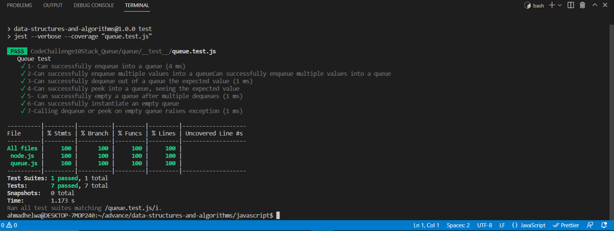
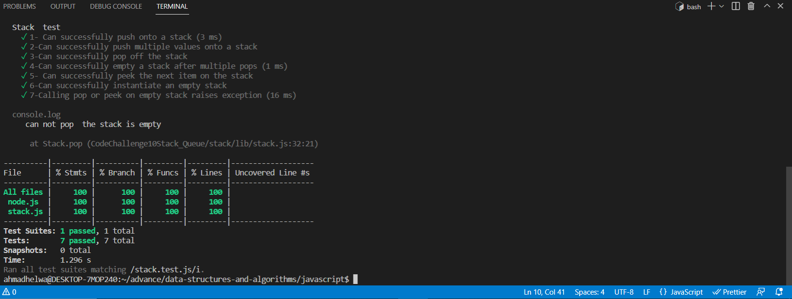

Stacks and Queues:
Contains a Stack, Queue, and Node class. The Stack operates on a last in first out (LIFO) basis, and the Queue operates on a first in first out (FIFO) basis. A Stack object contains a reference to its top Node, a Queue object contains references for the front and rear Nodes. Each Node contains a value and a reference to the next Node in the Stack/Queue.

# Test

