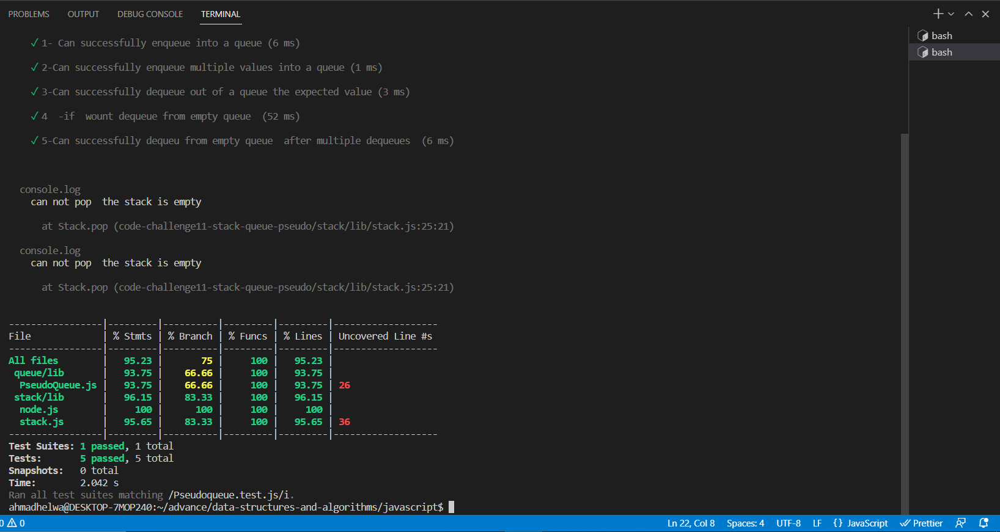

# Challenge Summary
Implement a Queue using two Stacks
Create a new class called pseudoqueue.

define two new stack .

create a methods:

enqueue

Arguments: value
to insert a value to pseudoqueue
dequeue

Arguments: none
to remove a element from pseudoqueue

# Test 

