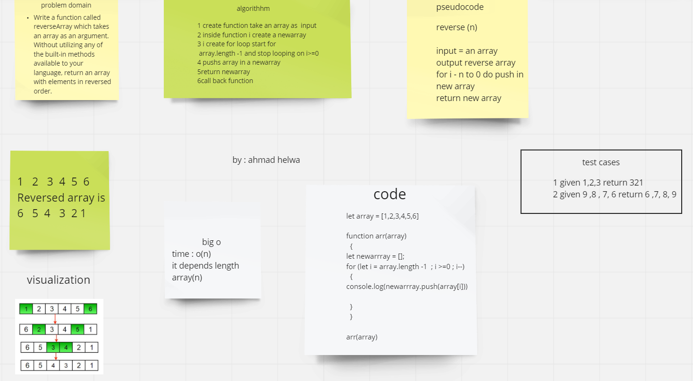

# Reverse an Array 
I have an array , I should return reverse an array ex. if I have [1,2,3] I should return [3,2,1] Without utilizing any of the built-in methods available to JS like reverse()

# Whiteboard Workflow 

